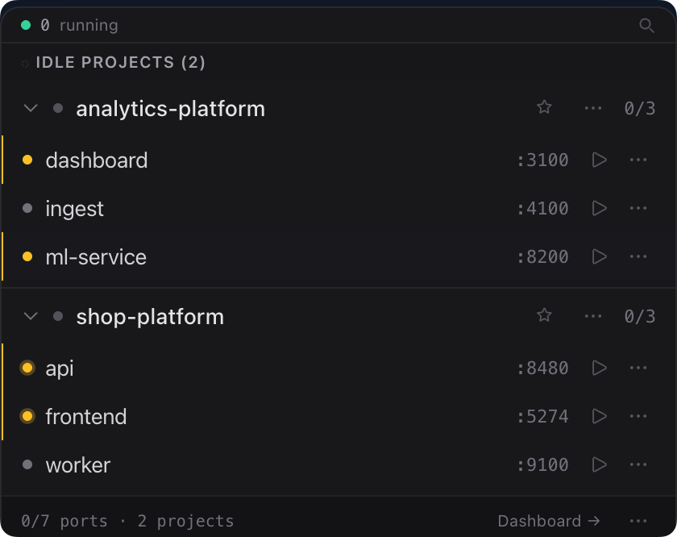

# service-starter

A system tray app that auto-discovers your dev projects and keeps an eye on ports and dependencies.

<center></center>

---

Drop one file in any project:

```yaml
name: my-api
components:
  api:
    startCommand: npm run dev
    ports:
      - port: 3000
        label: API Server
```

service-starter picks it up automatically — no config, no restart.

## Features

- Auto-discovers projects by scanning configured directories for `.service-starter.yml` files
- Monitors port usage — shows what's running, what's idle, flags conflicts between projects
- Checks dependency health: Docker containers, shell services, external APIs
- Quick actions from the tray: open in editor, open terminal, open in browser
- Runs short-lived commands with captured logs, even when they have no port

## Getting started

**1. Clone and install**

```bash
git clone https://github.com/sammy8806/service-starter.git
cd service-starter
npm install
```

**2. Build for your platform**

```bash
npm run build:mac    # macOS
npm run build:linux  # Linux
npm run build:win    # Windows
```

**3. Configure scan directories**

On first run, `~/.config/service-starter/config.yml` is created automatically. Edit it to point at your projects:

```yaml
scanDirectories:
  - ~/work
  - ~/projects
editor: code
terminal: iterm
```

Then add a `.service-starter.yml` to any project inside those directories and it will appear in the tray on the next scan.

## Manifest reference

For the full `.service-starter.yml` field reference and more examples — multi-component monorepos, Docker dependencies, cross-project dependencies, API health checks — see [docs/manifest-examples.md](docs/manifest-examples.md).
